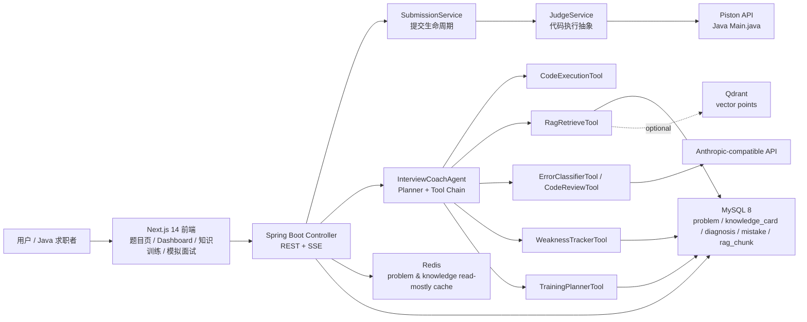

# AI Interview Coach Agent

基于 Agent Workflow 的 Java 代码诊断、后端知识训练与统一训练计划系统。

## 项目门面

AI Interview Coach Agent 面向 Java 后端求职训练，不做通用刷题站，也不做泛聊天助手。它把一次代码提交拆成可解释的工程链路：代码执行是 Tool，判题结果是 Observation，RAG 检索作为内部证据，AI 只负责错误归因和 AC 点评，最后把结果沉淀到弱点、错题卡、训练计划和模拟面试复盘。

**适合展示的能力：**

- Spring Boot 3 分层后端、MyBatis-Plus 和 MySQL 持久化建模
- Piston Java 代码执行服务封装，后续可替换 Docker Sandbox
- Agent Workflow、Tool Calling、Observation、SSE Agent Trace
- MySQL RAG V1，可选 Qdrant 混合检索，用户记忆按 `user_id` 隔离
- Redis 只读热点缓存，清楚区分缓存层和 MySQL 事实源
- Dashboard 学习闭环、知识训练、自测记录、模拟面试报告和训练计划追踪

## 架构图



## 功能截图

| 场景 | 截图 |
|------|------|
| 题库首页：20 题训练集、难度筛选、知识点筛选 |  |
| AI 诊断：失败现象、根本原因、修改方向、Agent 执行步骤 |  |
| 知识训练：后端知识卡、自测、解析和掌握度 |  |
| 模拟面试：主问题、实时反馈、会话状态 |  |
| 学习中心：今日训练、完整训练计划、下一步动作 |  |

更多截图索引见 [docs/SCREENSHOTS.md](docs/SCREENSHOTS.md)，包括 AI 诊断、RAG health、缓存状态和模拟面试报告的采集说明。

## 项目定位

不是通用刷题平台，不是简单 AI 聊天助手，不是 Spring Boot 包一层大模型 API。

核心价值：围绕一次 Java 代码提交，完成完整的 Agent 驱动训练闭环：

```text
题目预设提示 → 提交代码 → Piston 判题 → Agent Observation
→ 失败诊断 / AC 代码点评 → 弱点记忆 → 错题卡 → 训练计划
```

同时提供独立的知识训练入口，将 Java、JVM、Spring、MySQL、Redis 高频面试知识整理为结构化训练卡片，并在前端按 Java 核心、数据库、Spring、AI 工程组织为可折叠知识体系大纲。知识训练和算法诊断保持边界：算法错误只触发算法相关诊断，知识卡片用于独立自测和统一训练计划展示。

## 技术栈

| 层级 | 技术 |
|------|------|
| 前端 | Next.js 14 + Tailwind CSS + Monaco Editor |
| 后端 | Spring Boot 3 + Java 17 |
| 持久层 | MySQL 8 + MyBatis-Plus |
| 缓存 | Redis（题目与知识卡只读热点缓存） |
| 代码执行 | Piston API（可替换为 Docker 沙箱） |
| AI | Anthropic-compatible Messages API |
| 流式通信 | Server-Sent Events |

## 项目结构

```text
ai-study/
├── backend/                           # Spring Boot 后端
├── frontend/                          # Next.js 前端
├── data/                              # 数据库脚本
│   ├── schema.sql                     # 建表语句
│   ├── problems.sql                   # Hot100 精选 20 题数据
│   ├── hot100_solution_mode_migration.sql # 旧库统一 Solution 模式迁移
│   ├── knowledge_cards.sql            # 后端知识卡片种子数据
│   └── knowledge_training_migration.sql # 已有本地库升级脚本
├── docs/                              # 项目文档
│   ├── API.md                         # 接口文档
│   ├── IMPLEMENTATION_PLAN.md         # 实现计划
│   ├── PROJECT_STATUS.md              # 当前成果与下一步
│   ├── KNOWLEDGE_TRAINING_DESIGN.md   # 后端知识训练设计
│   ├── DEMO_CASES.md                  # 演示用例
│   ├── FINAL_ACCEPTANCE_CHECKLIST.md  # 最终验收清单和一键联调脚本说明
│   ├── SCREENSHOTS.md                  # 截图索引和补采清单
│   ├── ISSUES.md                       # 后续 GitHub Issues 草案
│   └── demo-cases/                    # 演示 bug/fixed 代码
├── .env                               # 环境变量（不提交）
├── start-backend.bat                  # Windows 启动脚本
└── start-backend.ps1                  # PowerShell 启动脚本
```

## 快速启动

### 前置依赖

- Java 17+
- Maven 3.8+
- Node.js 18+
- MySQL 8
- Redis（题目 / 知识卡热点缓存；不可用时自动降级 MySQL）
- Piston（代码执行服务）

### 1. 数据库初始化

```bash
# 创建数据库
mysql -u root -p -e "CREATE DATABASE ai_interview_coach CHARACTER SET utf8mb4;"

# 导入表结构和数据
mysql -u root -p ai_interview_coach < data/schema.sql
mysql -u root -p ai_interview_coach < data/problems.sql
mysql -u root -p ai_interview_coach < data/knowledge_cards.sql
```

如果数据库已经存在，先执行 Hot100 / Solution 模式幂等迁移，再导入题库和知识卡：

```powershell
cmd /c "mysql --default-character-set=utf8mb4 -u root -p ai_interview_coach < data\hot100_solution_mode_migration.sql"
cmd /c "mysql --default-character-set=utf8mb4 -u root -p ai_interview_coach < data\problems.sql"
cmd /c "mysql --default-character-set=utf8mb4 -u root -p ai_interview_coach < data\knowledge_training_migration.sql"
cmd /c "mysql --default-character-set=utf8mb4 -u root -p ai_interview_coach < data\learning_memory_continuity_migration.sql"
cmd /c "mysql --default-character-set=utf8mb4 -u root -p ai_interview_coach < data\rag_mysql_migration.sql"
cmd /c "mysql --default-character-set=utf8mb4 -u root -p ai_interview_coach < data\rag_vector_migration.sql"
cmd /c "mysql --default-character-set=utf8mb4 -u root -p ai_interview_coach < data\training_plan_source_migration.sql"
cmd /c "mysql --default-character-set=utf8mb4 -u root -p ai_interview_coach < data\training_plan_activity_migration.sql"
cmd /c "mysql --default-character-set=utf8mb4 -u root -p ai_interview_coach < data\knowledge_cards.sql"
```

PowerShell 不支持直接使用 Bash 风格的 `<` 输入重定向，所以 Windows 下建议使用上面的 `cmd /c` 写法。

导入或重新生成 `data/knowledge_cards.sql` 后，如果本地库已经存在 `rag_document` / `rag_chunk`，需要通过 `RagService.rebuildSystemIndex()` 或等价维护流程刷新系统题目和知识卡 chunk；这个重建只应处理 `user_id IS NULL` 的系统索引，不删除用户历史诊断和错题记忆。

### 2. 配置环境变量

复制 `.env.example` 为 `.env`，或直接创建 `.env`：

```bash
# MySQL
MYSQL_URL=jdbc:mysql://localhost:3306/ai_interview_coach?useUnicode=true&characterEncoding=utf8&useSSL=false&serverTimezone=Asia/Shanghai&allowPublicKeyRetrieval=true
MYSQL_USERNAME=root
MYSQL_PASSWORD=your_password

# Redis（题目 / 知识卡热点缓存；训练数据仍以 MySQL 为准）
REDIS_HOST=localhost
REDIS_PORT=6379
PROBLEM_CACHE_ENABLED=true
PROBLEM_CACHE_LIST_TTL=10m
PROBLEM_CACHE_DETAIL_TTL=30m
PROBLEM_CACHE_TEMPLATE_TTL=30m
KNOWLEDGE_CACHE_ENABLED=true
KNOWLEDGE_CACHE_CATEGORY_TTL=30m
KNOWLEDGE_CACHE_LIST_TTL=30m
KNOWLEDGE_CACHE_DETAIL_TTL=2h

# Piston（代码执行）
PISTON_BASE_URL=http://localhost:2000/api/v2

# AI（Anthropic-compatible）
AI_BASE_URL=https://api.anthropic.com
AI_API_KEY=your_api_key
AI_MODEL=claude-3-5-sonnet-latest

# Embedding（OpenAI-compatible，可选向量 RAG）
RAG_VECTOR_ENABLED=false
QDRANT_HOST=localhost
QDRANT_PORT=6334
QDRANT_USE_TLS=false
RAG_VECTOR_SIZE=1536
EMBEDDING_BASE_URL=https://dashscope.aliyuncs.com/compatible-mode
EMBEDDING_API_KEY=your_embedding_key
EMBEDDING_MODEL=text-embedding-v4
EMBEDDING_DIMENSIONS=1536
```

如果 Windows 本机 `2000` 端口被系统排除或已占用，可以把 Piston 映射到其他端口，例如 `2238`，并同步设置 `PISTON_BASE_URL=http://localhost:2238/api/v2`。

Redis 可用 Docker Compose 启动：

```powershell
docker compose up -d redis
```

题目和知识卡接口访问后可检查缓存 key：

```powershell
docker exec ai-study-redis redis-cli --scan --pattern "coach:problem:*"
docker exec ai-study-redis redis-cli --scan --pattern "coach:knowledge:*"
docker exec ai-study-redis redis-cli TTL coach:problem:list:v1
```

### 3. 启动后端

```bash
cd backend
mvn spring-boot:run
```

后端默认运行在 `http://localhost:8080`。

### 4. 启动前端

```bash
cd frontend
npm install
npm run dev
```

前端默认运行在 `http://127.0.0.1:4000`。本机 Windows 已保留 `3000` / `3001` 附近端口，所以 `npm run dev` 直接绑定到 `4000`，不再尝试使用 `3000`。

如果将来有人改回 `3000` / `3001`，Next.js 可能因为 Windows 系统保留端口段启动失败并报：

```text
Error: listen EACCES: permission denied 0.0.0.0:3000
```

这通常不是 Next.js 代码问题，而是端口被 Windows 排除。可以先检查：

```powershell
netsh interface ipv4 show excludedportrange protocol=tcp
netsh interface ipv6 show excludedportrange protocol=tcp
```

正常启动后访问 `http://127.0.0.1:4000`。

### 5. 一键端到端验收

演示前建议运行完整验收脚本：

```powershell
powershell -NoProfile -ExecutionPolicy Bypass -File scripts\local_dependency_preflight.ps1
```

预检脚本只读取本机状态，不写业务数据；它会检查 MySQL、Backend、Frontend、Piston、Redis、Qdrant 和 Docker，并输出 `READY_FOR_E2E_SMOKE` 与第一条 `NEXT_ACTION`。如果预检里 Piston / Qdrant / Redis / Docker 为 `MISSING`，先按 `NEXT_ACTION` 补齐运行时，再跑完整 smoke。

```powershell
powershell -NoProfile -ExecutionPolicy Bypass -File scripts\e2e_demo_smoke.ps1
```

脚本会真实检查 MySQL、Piston、Qdrant、Embedding、后端、前端，并自动跑 Two Sum 错误提交、SSE AI 诊断、AC 提交代码点评、Problem / Knowledge Cache Status / Refresh、Dashboard、RAG Health、RAG Vector Retry、RAG Chat 和向量落库检查。最终输出会包含 `goal_coverage`，形如 `training=...; rag=...; mockInterview=...; cache=...`，用一行汇总训练闭环、RAG 维护、模拟面试闭环和 Redis 缓存层四个大目标的当前验收证据。

如果只想先验证主链路，可临时跳过外部 embedding 或前端页面：

```powershell
powershell -NoProfile -ExecutionPolicy Bypass -File scripts\e2e_demo_smoke.ps1 -SkipEmbedding
powershell -NoProfile -ExecutionPolicy Bypass -File scripts\e2e_demo_smoke.ps1 -SkipFrontend
```

RAG 系统索引重建会在启用向量 RAG 时触发较多 embedding 调用，默认不在 smoke 中执行；需要验证维护链路时再显式开启：

```powershell
powershell -NoProfile -ExecutionPolicy Bypass -File scripts\e2e_demo_smoke.ps1 -RunRagRebuild
```

完整验收标准见 `docs/FINAL_ACCEPTANCE_CHECKLIST.md`。

## 核心功能

### 1. 题目与提交

- 内置 Hot100 精选 20 道 Java 算法题（数组、哈希表、链表、二叉树、动态规划、贪心、区间、网格等）
- 当前题库统一使用 LeetCode 风格 Solution 模式（用户提交非 `public` 的 `class Solution`）
- 题面使用“任务说明 / 返回要求 / 约束与边界”的面试式描述；左侧题解包含解题思路、易错点、复杂度和完整 Java 参考实现
- Monaco Editor 代码编辑器
- 后端在送入 Piston 前通过 `CodeWrapper` 注册表包装为 `Main.java`，数据库保存用户原始 Solution 代码
- Redis 缓存只接入题目列表、题目详情、题目模板、知识卡分类、知识卡列表和知识卡详情这类读多写少数据；Redis 失败时自动降级 MySQL，不影响提交、诊断、训练计划、自测和模拟面试。

### 1.1 Redis 热点缓存边界

Redis 是加速层，不是事实源。当前缓存 key：

```text
coach:problem:list:v1
coach:problem:detail:v1:{problemId}
coach:problem:template:v1:{problemId}
coach:knowledge:categories:v1
coach:knowledge:cards:v1:{category|ALL}
coach:knowledge:card:v1:{cardId}
```

默认 TTL：

```text
题目列表：10 分钟
题目详情：30 分钟
题目模板：30 分钟
知识卡分类：30 分钟
知识卡列表：30 分钟
知识卡详情：2 小时
```

可通过 `GET /api/cache/status` 查看 Redis 是否启用、ping 是否可用、最近检查时间 `checkedAt`、建议维护动作 `maintenanceAction`、命中率、MySQL 回源次数、最近降级原因、状态探测告警 `probeWarning`，以及题目 / 知识卡只读热点缓存当前匹配到的 `cachedKeyCount`。题目状态会拆出 `listCached`、`detailCachedKeyCount`、`templateCachedKeyCount`，知识卡状态会拆出 `categoryCached`、`listCachedKeyCount`、`detailCachedKeyCount`，便于定位到底是哪一层没有预热；如果 Redis ping 正常但 key 扫描 / hasKey 探测失败，统一状态会合并子缓存状态探测告警并标记为 `PARTIAL_DEGRADED`。通过 `POST /api/cache/refresh` 可以统一预热题目和知识卡缓存，响应里的 `refreshedAt` 记录本次刷新时间，`message` / `summary` 说明刷新结果，`totalWarmAttemptedCount` / `failedCount` 表示本次尝试覆盖的只读热点 key 数量和失败数量；Redis 不可用时 refresh 会跳过预热并保持 MySQL 事实源。Dashboard 可直接触发热点缓存刷新、刷新缓存状态和空态重试；刷新成功但状态回读失败时会保留刷新摘要并提示单独刷新状态。上述计数只用于演示预热和排障，不返回缓存内容，也不作为业务正确性的判断来源。

不会放入 Redis 的数据：

- 提交记录、判题结果、AI 诊断
- 弱点、错题卡、训练计划、知识卡自测记录和掌握度
- 模拟面试会话、报告和用户回答
- RAG 用户记忆、AgentContext 和 SSE 状态

这些数据仍由 MySQL 作为事实源，保证学习闭环和用户记忆不依赖缓存。

### 2. Agent Workflow 诊断

提交后触发 Agent 工作流。失败提交进入错误诊断和学习记忆分支；AC 提交进入轻量代码点评分支：

| 步骤 | 工具 | 说明 |
|------|------|------|
| PLANNING | - | 准备 Agent 上下文 |
| CODE_EXECUTION | CodeExecutionTool | 重新执行代码 |
| OBSERVATION | - | 观察判题结果 |
| RAG_RETRIEVAL | RagRetrieveTool | 检索题目知识、知识卡和当前用户历史学习记忆，失败不阻塞 |
| ERROR_CLASSIFICATION | ErrorClassifierTool | AI 分类错误类型 |
| CODE_REVIEW | CodeReviewTool | AC 提交的复杂度、风格和面试表达点评 |
| MEMORY_UPDATE | WeaknessTrackerTool | 更新弱点记忆和错题卡（非核心，失败不阻塞） |
| TRAINING_PLAN | TrainingPlannerTool | 生成 3 天训练计划（非核心，失败不阻塞） |

失败提交路径为 `PLANNING -> CODE_EXECUTION -> OBSERVATION -> RAG_RETRIEVAL -> ERROR_CLASSIFICATION -> MEMORY_UPDATE -> TRAINING_PLAN -> COMPLETED`；AC 提交路径为 `PLANNING -> CODE_EXECUTION -> OBSERVATION -> RAG_RETRIEVAL -> CODE_REVIEW -> COMPLETED`。`RAG_RETRIEVAL`、`MEMORY_UPDATE`、`TRAINING_PLAN` 和 AC 分支的 `CODE_REVIEW` 都是可降级步骤，核心判题和最终结果不因这些辅助步骤失败而中断。

### 3. 学习数据持久化

- **弱点记忆**：按知识点统计错误次数、薄弱分数和最近变化事件
- **错题卡片**：记录错误原因和正确思路，并按 fingerprint 合并重复错误；前端再按题目、知识点和用户可读错误模式聚合成复盘卡片
- **训练计划**：根据弱点生成 3 天针对性训练，每天包含 1 个算法复盘任务和 1 个后端知识卡复习任务，支持完成、跳过和重新生成
- **Dashboard / 学习中心**：按“统计 -> 今日优先训练 -> 下一步动作 -> 训练计划追踪 -> 完整训练计划 -> 薄弱点与错误分布 -> 最近提交 -> 最近模拟面试 -> 模拟面试闭环追踪 / 趋势 -> 合并错题卡 -> 缓存层状态 -> RAG 索引状态 -> AI 教练建议”组织真实学习数据。训练计划追踪、最近模拟面试、模拟面试闭环追踪、趋势、缓存状态和 RAG health 都是辅助卡片，首屏失败时降级为空态，不阻断主数据；手动刷新时 trace / trend 单点失败只影响对应卡片。

### 4. 后端知识训练

- 独立 `/knowledge` 页面，左侧为可展开/收起的知识体系大纲：Java 核心、数据库、Spring、AI 工程
- 页面优先读取后端知识接口和 `knowledge_card` 表；后端不可用时回退前端本地示例数据
- Java 集合专题已按 List / Map / Set 做前端过滤，面包屑、左侧高亮和专题标题共用同一选择状态；Map 不展示 ArrayList / LinkedList 等明显不匹配卡片
- AI 工程当前是前端专题入口，包含 Agent、RAG、LangChain，并提供少量本地示例卡作为接口不可用时的兜底训练内容；不新增后端接口、不接独立 RAG 聊天、不调用真实 AI
- `data/knowledge_cards.sql` 提供 120 张结构化知识卡，覆盖侧边栏 24 个最终专题且每个专题至少 5 张；内容参考小林 coding 和 JavaGuide 的选题覆盖后重新整理表达，AI 工程卡片为项目原创整理
- 每张卡包含难度、分类、tags、训练状态、最近得分或未自测状态、模拟自测、点评反馈、标杆回答解析、核心记忆要点、面试官高频追问和“标记已掌握”
- 展开后默认先自测，提交自测或点击“跳过自测，直接查看解析”后才显示答案区
- 提交自测后写入后端自测记录，更新知识卡掌握度；低分自测会进入弱点事件

### 5. 分层提示机制

- **题目预设提示**：存储在后端 `problem` 表，通过 API 返回，Level 1/2/3 展示在左侧题目区，不调用 AI
- **AI 诊断**：针对本次提交展示教练报告，包括失败现象、根本原因、修改方向、面试提醒和推荐训练；运行时异常会摘要化展示，完整堆栈保留在测试结果中

## 演示流程

推荐演示顺序：

1. **1 两数之和**：HashMap 查询/写入顺序 bug
2. **206 反转链表**：返回原始 head
3. **121 买卖股票的最佳时机**：用于展示低门槛 AC 点评

演示步骤：

```text
打开 /problem/1 -> 展示题目预设提示和 Solution 模板
-> 按 docs/DEMO_CASES.md 中的 Two Sum bug 样例提交失败
-> 观察 failedCases 和 SSE Agent timeline
-> 重点讲 OBSERVATION -> RAG_RETRIEVAL -> ERROR_CLASSIFICATION
-> 展示 AI 诊断、弱点记忆、错题卡和训练计划
-> 打开 /dashboard 展示学习闭环、RAG health 和缓存状态
-> 按 docs/DEMO_CASES.md 中的 fixed 样例重新提交通过
-> 展示 AC code review
-> 打开 /mock-interview 展示知识卡模拟面试和报告复盘
```

详细演示用例见 `docs/DEMO_CASES.md`。

## 后端架构

```text
com.interview.coach
├── controller          # 接收 HTTP 请求，返回 VO
├── service             # 业务接口
│   └── impl            # 业务实现
├── agent               # Agent 编排器、状态、上下文
│   └── tool            # 代码执行、错误分类、代码点评、弱点追踪等 Tool
├── integration
│   ├── piston          # Piston 代码执行客户端
│   └── ai              # Anthropic-compatible AI 客户端
├── entity              # MySQL 表映射
├── mapper              # MyBatis-Plus Mapper
├── dto                 # 请求参数
├── vo                  # 响应对象
├── enums               # 枚举定义
├── config              # 配置类
└── handler             # 全局异常处理
```

## 接口总览

| 方法 | 路径 | 说明 |
|------|------|------|
| GET | `/api/problems` | 获取题目列表 |
| GET | `/api/cache/status` | 题目 / 知识卡统一 Redis 缓存状态摘要 |
| POST | `/api/cache/refresh` | 刷新并预热题目 / 知识卡只读热点缓存 |
| GET | `/api/problems/cache/status` | 题目 Redis 缓存状态摘要 |
| POST | `/api/problems/cache/refresh` | 刷新并预热题目 Redis 缓存 |
| GET | `/api/problems/{id}` | 获取题目详情 |
| GET | `/api/problems/{id}/template` | 获取代码模板 |
| POST | `/api/submissions` | 提交代码并判题 |
| POST | `/api/agent/analyze` | 同步 Agent 诊断 |
| GET | `/api/submissions/{id}/diagnosis/stream` | SSE 流式诊断 |
| GET | `/api/users/{id}/dashboard/stats` | Dashboard 统计 |
| GET | `/api/users/{id}/weaknesses` | 薄弱点排行 |
| GET | `/api/users/{id}/weakness-events/recent` | 最近弱点事件 |
| GET | `/api/users/{id}/mistakes` | 错题卡片 |
| GET | `/api/users/{id}/training-plans/latest` | 最新训练计划 |
| GET | `/api/users/{id}/training-plans/history` | 训练计划历史摘要 |
| GET | `/api/users/{id}/training-plans/activities/recent` | 最近完成 / 跳过的训练项 |
| GET | `/api/users/{id}/training-plans/trace` | 最新训练计划追踪摘要 |
| PATCH | `/api/users/{id}/training-plans/items/{itemId}/status` | 更新训练计划条目状态 |
| POST | `/api/users/{id}/training-plans/regenerate` | 手动重新生成训练计划 |
| GET | `/api/users/{id}/dashboard/error-stats` | 错误统计 |
| GET | `/api/users/{id}/submissions/recent` | 最近提交记录 |
| GET | `/api/users/{id}/mock-interviews/recent` | 最近模拟面试记录 |
| GET | `/api/users/{id}/mock-interviews/trace` | 模拟面试闭环追踪摘要 |
| GET | `/api/users/{id}/mock-interviews/trends` | 模拟面试知识点趋势 |
| GET | `/api/knowledge/categories` | 后端知识分类 |
| GET | `/api/knowledge/cards` | 后端知识卡片列表 |
| GET | `/api/knowledge/cards/{id}` | 后端知识卡片详情 |
| POST | `/api/users/{id}/knowledge/cards/{cardId}/self-tests` | 提交知识卡自测 |
| GET | `/api/users/{id}/knowledge/cards/{cardId}/self-tests/recent` | 获取最近知识卡自测 |
| POST | `/api/rag/chat` | 受控学习资料问答 |
| GET | `/api/rag/health` | RAG 索引健康检查摘要 |
| POST | `/api/rag/system-index/rebuild` | 重建系统题目 / 知识卡 RAG 索引 |
| POST | `/api/rag/vector/retry-failed` | 重试失败 RAG 向量索引 |
| POST | `/api/mock-interviews` | 创建模拟面试会话 |
| GET | `/api/mock-interviews/{sessionId}` | 获取 / 恢复模拟面试会话 |
| POST | `/api/mock-interviews/{sessionId}/answers` | 提交面试回答 |
| POST | `/api/mock-interviews/{sessionId}/finish` | 生成模拟面试报告 |

完整接口文档见 `docs/API.md`。

## 简历亮点

### 简洁版

```text
AI Interview Coach：基于 Spring Boot、Next.js 和 LLM 构建面向 Java 后端求职者的 AI 面试训练系统，
实现算法题在线提交、Piston 代码执行、测试结果解析、AI 错误诊断、分层提示、后端知识卡片训练、薄弱知识点统计和统一训练计划生成。
```

### Agent 重点版

```text
设计基于状态机的 Agent Workflow，将代码执行、错误分类、代码点评、弱点追踪、训练规划封装为独立 Tool，
通过 Agent 编排器串联执行。代码执行结果作为 Observation 输入后续推理节点，每步记录 Agent Step，
并通过 SSE 流式输出执行过程。
```

## 文档索引

| 文档 | 用途 |
|------|------|
| [AI-Interview-Coach.md](docs/AI-Interview-Coach.md) | 项目设计、数据库表、API 设计、简历包装 |
| [API.md](docs/API.md) | 当前后端接口规范 |
| [IMPLEMENTATION_PLAN.md](docs/IMPLEMENTATION_PLAN.md) | 实现计划与阶段划分 |
| [PROJECT_STATUS.md](docs/PROJECT_STATUS.md) | 当前成果、风险、下一步大纲 |
| [FINAL_ACCEPTANCE_CHECKLIST.md](docs/FINAL_ACCEPTANCE_CHECKLIST.md) | 演示前验收清单和 smoke 证据 |
| [SCREENSHOTS.md](docs/SCREENSHOTS.md) | 功能截图索引和补采清单 |
| [ISSUES.md](docs/ISSUES.md) | 后续 GitHub Issues 草案 |
| [KNOWLEDGE_TRAINING_DESIGN.md](docs/KNOWLEDGE_TRAINING_DESIGN.md) | 知识训练模块设计与前端 V1 交互 |
| [DEMO_CASES.md](docs/DEMO_CASES.md) | 演示用例与 bug 样例 |

## License

MIT
